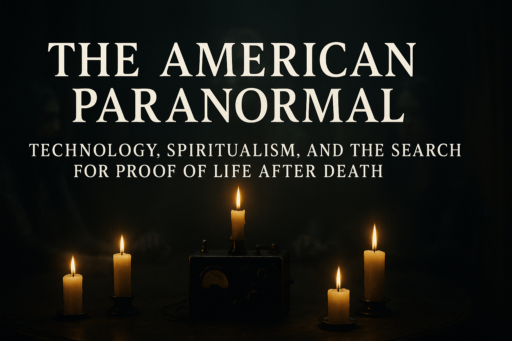

# THE AMERICAN PARANORMAL
### ADVANCED ITC ANOMALY LAB
**v3.3 RELEASE CANDIDATE**

 

## 🔻 SELECT YOUR ENGINE 🔻
*Click a module below to launch the software in your browser*

| **1. THE FLAGSHIP** | **2. THE SPECIALIST** | **3. THE SCIENTIST** |
| :---: | :---: | :---: |
| [**🚀 LAUNCH v3.3 ULTIMATE**](https://skdietrich.github.io/The-American-Paranormal/ultimate.html) | [**🧠 LAUNCH v3.2 PSI**](https://skdietrich.github.io/The-American-Paranormal/psi.html) | [**📐 LAUNCH v2.6 MAX**](https://skdietrich.github.io/The-American-Paranormal/max.html) |
| **Hybrid System** Robust Math + Psi Theory | **Resonance Engine** Entropy & Entrainment | **Validation Engine** Pure Statistical Rigor |

---

## 📋 EXECUTIVE SUMMARY
**The American Paranormal ITC Suite** represents the next generation of environmental anomaly detection, engineered for serious investigators and researchers. Unlike consumer-grade "ghost boxes" that rely on random radio sweeps, this platform utilizes **AudioWorklet** technology and proprietary statistical algorithms to analyze environmental audio in real-time.

This software serves as the official digital companion to the book **"The American Paranormal,"** providing readers with the rigorous tools necessary to validate environmental shifts, entropy fluctuations, and potential transcommunication events.

---

## 🔬 TECHNICAL SPECIFICATIONS

### 1. v3.3 Ultimate (The Hybrid)
**Target User:** Field Investigators & Lead Researchers
The flagship system combining our most advanced detection methodologies into a single interface.
* **Core Tech:** Integrates Robust Multivariate Statistics with experimental Psi-interaction theories.
* **Key Modules:** Schumann Resonator (7.83Hz Carrier), Inverse Entropy Listener, and Robust Scoring ($m^2$).

### 2. v3.2 Psi-Enhanced (The Specialist)
**Target User:** Experimentalists & Mediums
A streamlined, low-latency build focusing purely on consciousness-based variables and frequency entrainment.
* **Core Tech:** High-sensitivity Negentropy (Order) detection.
* **Key Modules:** 110Hz/7.83Hz Isochronic Entrainment loop.

### 3. v2.6 MAX (The Scientist)
**Target User:** Data Analysts & Skeptics
A high-fidelity statistical instrument designed to eliminate false positives through rigorous mathematical modeling.
* **Core Tech:** Conformal Prediction and Martingale Evidence Accumulation.
* **Key Capabilities:** Distribution-free p-value generation ($p \le 0.01$).

---

## ⚖️ PROTOCOLS & SAFETY

To maintain data integrity and safety standards, all operators are required to adhere to the following protocols:

1.  **The Baseline Protocol:** Calibration is mandatory. Never initiate a session without running the **10-second Calibration** sequence to establish the room's noise floor covariance.
2.  **The Isolation Protocol:** Devices should be placed in Airplane Mode (Wi-Fi enabled) to eliminate RF interference false positives.
3.  **The Verification Protocol:** A "Red" meter alert indicates a statistical anomaly, not a supernatural conclusion. Cross-reference with external sensors.

---

  
<b>SECURE CONTEXT REQUIRED // MICROPHONE ACCESS MANDATORY</b>

  
© 2025 The American Paranormal Project. Developed by skdietrich.

